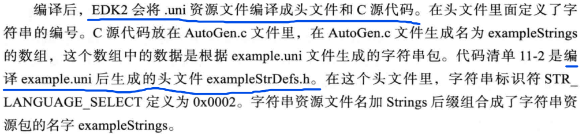
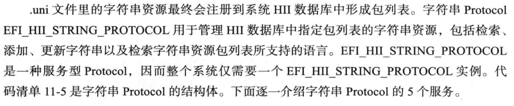
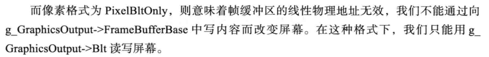

# 《UEFI原理与编程》阅读笔记  

资源：[《UEFI原理与编程》](../assets/UEFI原理与编程_戴正华(著)%20机械工业出版社_完整版.pdf)  

## GUI基础  

### 字符串资源  

  

这里可能有误（也许是edk2版本问题），实际测试发现编译生成的字符串资源头文件名是`模块名+StrDefs.h`，可以参考[HiiTest.inf](../../SimplePkg/App/HiiTest/HiiTest.inf)，其中`BASE_NAME = HiiTest`，在同目录下有[example.uni](../../SimplePkg/App/HiiTest/example.uni)，编译之后生成HiiTestStrDefs.h，并且AutoGen.c中的字符串资源数组名为`HiiTestStrings`，这个数组也叫字符串包（Packages）  

也可能是我理解错误，因为作者这里使用example.uni的模块名可能就是example  

使用字符串资源首先要把字符串资源包添加到**HiiDataBase**里（返回一个HiiHandle），当然事先要准备一个用于识别它的GUID，然后可以利用返回的HiiHandle，使用库函数或者`EFI_HII_STRING_PROTOCOL`调用字符串资源，参考[HiiTest.c](../../SimplePkg/App/HiiTest/HiiTest.c)  

  

详情请见原书*11.1.3*节  

使用protocol和lib的区别在于字符串内存分配与释放  
  

显示模式和设定显示内容的关系（单独列举出来是因为模拟环境下的显示模式为PixelBltOnly，Blt意为Block Transfer），显示模式为PixelBitMask时，通过设置PixelInformation{RGBA}设定显示样式，虽然alpha通道值在结构体内是名称定义为Reserved的值  
  
