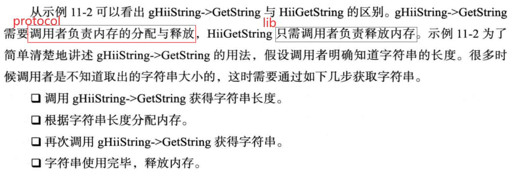

# 《UEFI原理与编程》阅读笔记  

资源：[《UEFI原理与编程》](../assets/UEFI原理与编程_戴正华(著)%20机械工业出版社_完整版.pdf)  

## GUI基础  

### 字符串资源  

  

这里可能有误（也许是edk2版本问题），实际测试发现编译生成的字符串资源头文件名是`模块名+StrDefs.h`，可以参考[HiiTest.inf](../../SimplePkg/App/HiiTest/HiiTest.inf)，其中`BASE_NAME = HiiTest`，在同目录下有[example.uni](../../SimplePkg/App/HiiTest/example.uni)，编译之后生成HiiTestStrDefs.h，并且AutoGen.c中的字符串资源数组名为`HiiTestStrings`，这个数组也叫字符串包（Packages）  

也可能是我理解错误，因为作者这里使用example.uni的模块名可能就是example  

使用字符串资源首先要把字符串资源包添加到**HiiDataBase**里（返回一个HiiHandle），当然事先要准备一个用于识别它的GUID，然后可以利用返回的HiiHandle，使用库函数或者`EFI_HII_STRING_PROTOCOL`调用字符串资源，参考[HiiTest.c](../../SimplePkg/App/HiiTest/HiiTest.c)  

  

详情请见原书*11.1.3*节  

使用protocol和lib的区别在于字符串内存分配与释放  
  

显示模式和设定显示内容的关系（单独列举出来是因为模拟环境下的显示模式为PixelBltOnly，Blt意为Block Transfer），显示模式为PixelBitMask时，通过设置PixelInformation{RGBA}设定显示样式，虽然alpha通道值在结构体内是名称定义为Reserved的值  
  

### 字符串相关函数  

在下列函数前面加上**Ascii**就是用于ASCLL字符的函数，默认是作用于Unicode16字符串的  

  

  

## UEFI驱动开发  

驱动的概念和种类  

UEFI Driver的引入，更好的实现了模块化，模块化可以理解为这些UEFI Driver就是用来管理设备的，如果说Driver用来管理显卡，那么显卡的厂商就可以独立撰写一个UEFI Driver，这个Driver可以运行在所有的UEFI环境下面，而不必根据不同的环境进行调整。

所以对于UEFI Driver的模块化，可以做bindary形式的发布，可以build in 到option rom里面去，对外的入口是非常清晰的。这就是为什么说UEFI Driver把整个firmware扩展了，提高了固件整体的扩展性，可能说之前的固件只能跑跑Application，现在还可以加载很多的Driver，第三方写的一些Device Driver，可能不需要build in到flash上，可以在shell阶段重新加载或在BDS阶段加载。

对于跨平台性，同样一个Driver按照二进制形式进行发布后，就可以在所有follow UEFI规范的平台跑起来，这样的方式大家可以并行开发，平台开发和设备开发分别进行，加快进程，最后协同到一起。  

  

上图明确展现了UEFI Driver的的概念，PEIM为PEI阶段的module，APP属于OS下面的Driver，UEFI Driver就可以泛指DXE和BDS之间的Driver，也可以理解为在PEI之后OS之前的所有Driver的泛称。包括EFI Driver Model Driver（协议比较相关，无论平台是Intel 还是Arch都要按照这个标准来）以及非该类型的Non-Driver Model Driver （和平台相关）。

Service Driver：如常见的BootService、RuntimeService等等服务驱动
Initializing Driver：初始化服务、CPU 芯片 设备等的初始化驱动 FchDxe / PchDxe / CpuDxe
Root Bridge Drivers：PCIE的根桥设备等 根桥驱动 (x86架构使用的是PCI Bus) PciHostBridge
EFI 1.02 Drivers: 符合EFI 1.02规范的非Non-Driver Model Driver

Bus Drivers: 总线驱动, 用于驱动总线上的设备 PciBus / UsbBus / AtaBus / SMBus /…
Device Drivers: 设备驱动, 用于驱动设备 SATA / NVME / GOP/ Keyboard / Mouse /…
Hybrid Drivers: 既有总线驱动又包括设备驱动 (不太常用)

————————————————  
引自CSDN博主「Hi,Hubery」的原创文章  
原文链接：https://blog.csdn.net/weixin_45279063/article/details/117949431  

### 服务型驱动  

服务型驱动的特点（在模拟环境中先`load`）:  

  

example:  
[实现-HelloDxeEntry.c](../../SimplePkg/Dxes/HelloDxe/HelloDxeEntry.c)  
[使用-UseHelloDxe.c](../../SimplePkg/App/UseHelloDxe/UseHelloDxe.c)  

### UEFI驱动模型  

加载启动的过程，详见原书*9.1.1*节  

  

EDBP (**E**FI **D**river **B**inding **P**rotocol)  
ECNP (**E**FI **C**omponent **N**ame **P**rotocol)  [ECN2P]  

### PCI设备驱动基础  

