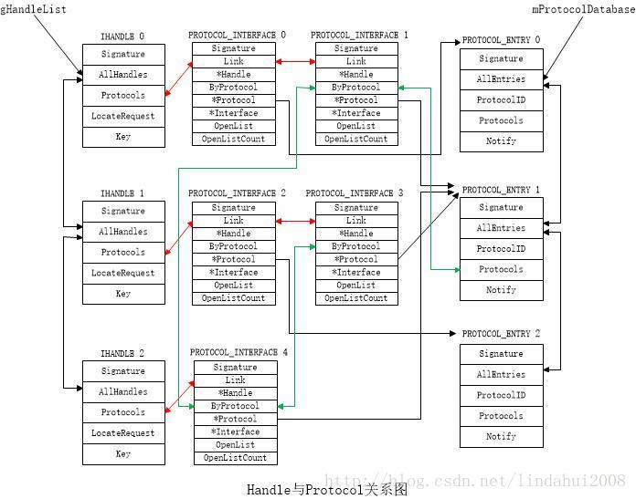

# edk2-底层原理  

底层基础介绍见 [edk2-底层基础](./edk2-底层基础.md)  

注：本文中提及的`protocol`与`协议`两词完全等价  

## gBS中的服务  

其实现在 [MdeModulePkg/Core/Dxe/DxeMain/DxeMain.c](../../../MdeModulePkg/Core/Dxe/DxeMain/DxeMain.c) 中，其中`EFI_BOOT_SERVICES mBootServices`结构体变量包含了所有`gBS`成员的实现  

### CreateEvent  

```c
EFI_CREATE_EVENT CreateEvent;

typedef
EFI_STATUS
(EFIAPI *EFI_CREATE_EVENT)(
  IN  UINT32                       Type,
  IN  EFI_TPL                      NotifyTpl,
  IN  EFI_EVENT_NOTIFY             NotifyFunction,
  IN  VOID                         *NotifyContext,
  OUT EFI_EVENT                    *Event
  );
```

这个函数是edk2中的EFI事件创建函数。其参数解释如下：

- `Type` 事件类型，可以是EFI_TIMER、EFI_TPL、EFI_NOTIFY_SIGNAL等。
- `NotifyTpl` 通知函数的调度级别，可以是EFI_TPL_APPLICATION、EFI_TPL_CALLBACK、EFI_TPL_NOTIFY或EFI_TPL_HIGH_LEVEL。
- `NotifyFunction` 事件通知函数指针。
- `NotifyContext` 事件通知函数上下文指针。
- `Event` 指向创建事件的指针。

该函数的作用是创建一个事件，并返回该事件的指针，以便在以后需要时操作该事件。创建一个事件后，可以使用EFI_SIGNAL_EVENT函数发送信号，使用EFI_WAIT_FOR_EVENT函数等待事件被触发。在使用完事件后，应使用EFI_CLOSE_EVENT函数释放事件的资源。  

### SetTimer  

```c
EFI_SET_TIMER SetTimer;

typedef
EFI_STATUS
(EFIAPI *EFI_SET_TIMER)(
  IN  EFI_EVENT                Event,
  IN  EFI_TIMER_DELAY          Type,
  IN  UINT64                   TriggerTime
  );
```

这个函数是edk2中的EFI定时器设置函数。其参数解释如下：

- `Event` 指向所要设置的事件指针。
- `Type` 定时器类型，可以是EFI_TIMER_PERIODIC或EFI_TIMER_RELATIVE。
- `TriggerTime` 定时器到期时间，以毫秒为单位。

该函数的作用是设置一个定时器并将其绑定到指定的事件上。在定时器到期时，事件会被触发。Type参数用于指定定时器的类型，可以是循环定时器（EFI_TIMER_PERIODIC）或单次定时器（EFI_TIMER_RELATIVE）。TriggerTime参数用于指定定时器到期的时间，单位是**100ns**（$10^9ns=1s$）。该函数返回EFI_STATUS类型的值，如果设置定时器成功，则返回EFI_SUCCESS，如果指定的事件无效，则返回EFI_INVALID_PARAMETER。

### WaitForEvent  

```c
EFI_WAIT_FOR_EVENT WaitForEvent;

typedef
EFI_STATUS
(EFIAPI *EFI_WAIT_FOR_EVENT)(
  IN  UINTN                    NumberOfEvents,
  IN  EFI_EVENT                *Event,
  OUT UINTN                    *Index
  );
```

这个函数定义是一个函数指针类型 EFI_WAIT_FOR_EVENT，它指向一个具有以下特征的函数：

- `NumberOfEvents` 是一个无符号整数类型，表示要等待的事件的数量。

- `Event` 是一个指向EFI事件类型的指针数组，表示要等待的事件句柄数组。

- `Index` 是一个指向无符号整数类型的指针，表示收到信号的事件在Event数组中的索引。如果Index参数为空，则不会返回任何信息。

在EDK II中，这个函数通常是作为UEFI引导服务的一部分实现的。它的功能是等待一组事件中的至少一个事件发生。当一个事件被触发时，此函数会返回一个索引，该索引对应的事件已被触发。

这个函数的具体实现方式取决于UEFI固件的厂商实现。在实践中，所有的UEFI固件实现都至少包含了一个基本的EFI_WAIT_FOR_EVENT函数，它可以用于等待事件的发生并处理事件。

### SignalEvent  

```c
EFI_SIGNAL_EVENT SignalEvent;

typedef
EFI_STATUS
(EFIAPI *EFI_SIGNAL_EVENT)(
  IN  EFI_EVENT                Event
  );
```

手动触发传入的Event  

参数说明如下：

- `Event` 要发送信号的EFI_EVENT类型的事件对象。

这个函数只有一个参数，即要发送信号的事件对象。事件对象是一个简单的指针类型，表示一个EFI_EVENT结构体实例。EFI_EVENT结构体用于创建、管理和等待事件。在调用`gBS->CreateEvent`函数创建事件对象后，可以将其作为参数传递给这个函数，用于向事件对象发送信号。当事件对象接收到信号后，它将进入已触发状态，并将通知所有等待它的线程或任务。

### CloseEvent  

```c
EFI_CLOSE_EVENT CloseEvent;

typedef
EFI_STATUS
(EFIAPI *EFI_CLOSE_EVENT)(
  IN EFI_EVENT                Event
  );
```

关闭事件，释放资源  

### CheckEvent

```c
EFI_CHECK_EVENT CheckEvent;

typedef
EFI_STATUS
(EFIAPI *EFI_CHECK_EVENT)(
  IN EFI_EVENT                Event
  );
```

该函数通常用于检查事件是否已被触发。如果事件已被触发，该函数会返回EFI_SUCCESS，否则会返回一个错误码。  

### RegisterProtocolNotify  

```c
EFI_REGISTER_PROTOCOL_NOTIFY RegisterProtocolNotify;

typedef
EFI_STATUS
(EFIAPI *EFI_REGISTER_PROTOCOL_NOTIFY) (
  IN EFI_GUID                 *Protocol,
  IN EFI_EVENT                Event,
  OUT VOID                    **Registration
);
```

它被用来注册一个回调函数，该回调函数会被调用用来通知这个注册的协议被安装到系统中，即当 EFI_GUID 指定的协议接口被安装到系统中时，Event 事件会被触发，指向的函数将被调用。具体来说：  

- `Protocol` 是指向要安装的 protocol 的 GUID 的指针。  
- `Event` 是通知事件的句柄，即服务通知要安装新的 protocol。当新的 protocol 被加载时，通知事件会触发。事件可以是用 EFI_CREATE_EVENT 创建的任何类型。  
- `Registration` 是指针，用于返回在安装 protocol 时引用该 protocol 的结构的指针。  

此函数的返回状态必须为 EFI_SUCCESS，以表示Protocol已成功安装，并且 Registration 指针被更新，其指向某个数据结构，该数据结构包含了 protocol 的相关信息，供后续使用。  

具体的行为如下：  

- 调用 RegisterProtocolNotify 函数时，将传入一个 protocol GUID 和一个回调函数指针。  
- 系统会在拥有该 protocol 的驱动程序被安装时调用该回调函数，并将该 protocol 和它所对应的句柄作为参数传入回调函数。  
- 回调函数可以进行 protocol 的初始化和使用。  

这种机制使得前期开发的UEFI应用程序可以更加灵活地响应系统中动态安装的驱动程序。  

### InstallProtocolInterface 和 UninstallProtocolInterface  

```c
EFI_INSTALL_PROTOCOL_INTERFACE InstallProtocolInterface;
EFI_UNINSTALL_PROTOCOL_INTERFACE UninstallProtocolInterface;

EFI_STATUS InstallProtocolInterface(
  EFI_HANDLE                *Handle,
  EFI_GUID                  *Protocol,
  EFI_INTERFACE_TYPE        InterfaceType,
  VOID                      *Interface
);

EFI_STATUS UninstallProtocolInterface(
  EFI_HANDLE                Handle,
  EFI_GUID                  *Protocol,
  VOID                      *Interface
);

```

InstallProtocolInterface 函数用于安装协议，参数包括:

- `Handle` 输出参数，指向与安装的协议相关的句柄。
- `Protocol` 要安装的协议所对应的GUID。
- `InterfaceType` 协议和驱动程序之间的接口类型。
- `Interface` 接口的指针。

UninstallProtocolInterface 函数用于卸载协议，参数包括:

- `Handle` 要卸载协议所对应的句柄。
- `Protocol` 要卸载的协议所对应的GUID。
- `Interface` 协议的接口指针。

具体行为：  

- InstallProtocolInterface: 通过该函数安装一个协议实例，需要传入协议的唯一标识符 GUID，协议对象的指针，如包含接口的二进制结构体等，还需要传入一个指向协议实例的指针，该指针可以被其他驱动程序访问该协议。在安装协议时，可以指定回调函数，以在特定事件发生时提供服务。具体而言，该协议实例将成为系统中安装该协议的所有驱动程序的共享资源。返回 EFI_SUCCESS 表示安装成功，否则表示安装失败。  

- UninstallProtocolInterface: 通过该函数，可以删除先前安装的协议实例，取决于安装协议时的句柄值。在卸载协议实例前，必须确保该协议实例不再被其他驱动程序引用。返回 EFI_SUCCESS 表示卸载成功，否则表示卸载失败。  

需要注意的是，协议安装函数和卸载函数之间有依赖关系。在卸载一个协议之前，必须保证该协议不再被其他驱动程序所引用。因此，卸载函数有时需要采取特殊措施以避免遗漏引用。如果漏掉了引用，则可能导致系统崩溃。  

这两个函数都返回EFI_STATUS类型的结果，如果操作成功，则返回EFI_SUCCESS，否则返回一个错误码。  

## 详解安装 protocol  

当谈到一个UEFI协议被安装时，我们指的是某个驱动程序使用`InstallProtocolInterface`函数来创建了该协议的一个实例，并将其安装到UEFI系统的全局协议数据库（Protocol Database）中，用以提供给其他相关的UEFI驱动程序使用。  

在实现上，协议被安装到系统的全局协议数据库中，可以通过调用EFI_BOOT_SERVICES提供的OpenProtocol或者HandleProtocol等函数，使用协议来与操作系统、设备或其他驱动程序进行通信。在安装协议时，协议的实例指针会被添加到全局协议数据库的数据结构中，因为这样才能在OpenProtocol或HandleProtocol等函数中通过协议的GUID来查询该协议的实例，然后进行进一步的使用或操作。  

需要注意的是，在一些场景下，协议的实例指针可以被安装到UEFI系统的其他数据结构中，比如在设备对象的Open函数中传入的上下文指针中，以供设备驱动程序使用。但不管协议的实例指针存放在哪里，只要安装到了系统中、可被其他驱动程序获取、使用，就可以认为该协议被成功安装。  

全局协议数据库（Protocol Database）指的是UEFI系统中一个用来储存已安装协议和其对应实例的数据结构。具体的结构包括一个链表和多个哈希表，用来提高协议查找效率。  

每个协议都有一个唯一的GUID，GUID是一个128位的全局唯一标识符。在UEFI系统中，协议的安装和查找都是通过GUID来完成的。因为GUID是全局唯一的，所以通过查找GUID可以直接找到对应的协议实例。  

协议实例指针可以被安装到UEFI系统的其他数据结构中，这意味着其他数据结构可以通过协议实例指针来获取协议提供的服务。比如一个驱动程序可以在其加载时将协议实例指针安装到系统的某个数据结构中，另一个驱动程序再通过该数据结构获取协议提供的服务。  

接下来介绍一下安装protocol全过程的底层实现  

`InstallProtocolInterface`的实现函数为`CoreInstallProtocolInterface`，它在[MdeModulePkg/Core/Dxe/Hand/Handle.c](../../../MdeModulePkg/Core/Dxe/Hand/Handle.c)中，但真正起作用的是`CoreInstallProtocolInterface`，我们最熟悉不过的一条 DEBUG INFO 就在其中  

```c
DEBUG((DEBUG_INFO, "InstallProtocolInterface: %g %p\n", Protocol, Interface));
```

```c
EFI_STATUS
EFIAPI
CoreInstallProtocolInterface (
  IN OUT EFI_HANDLE     *UserHandle,
  IN EFI_GUID           *Protocol,
  IN EFI_INTERFACE_TYPE InterfaceType,
  IN VOID               *Interface
  )
{
  return CoreInstallProtocolInterfaceNotify (
            UserHandle,
            Protocol,
            InterfaceType,
            Interface,
            TRUE
            );
}

EFI_STATUS
CoreInstallProtocolInterfaceNotify (
  IN OUT EFI_HANDLE     *UserHandle,
  IN EFI_GUID           *Protocol,
  IN EFI_INTERFACE_TYPE InterfaceType,
  IN VOID               *Interface,
  IN BOOLEAN            Notify
  )
{
  PROTOCOL_INTERFACE  *Prot;
  PROTOCOL_ENTRY      *ProtEntry;
  IHANDLE             *Handle;
  EFI_STATUS          Status;
  VOID                *ExistingInterface;

  //
  // returns EFI_INVALID_PARAMETER if InterfaceType is invalid.
  // Also added check for invalid UserHandle and Protocol pointers.
  //
  if (UserHandle == NULL || Protocol == NULL) {
    return EFI_INVALID_PARAMETER;
  }

  if (InterfaceType != EFI_NATIVE_INTERFACE) {
    return EFI_INVALID_PARAMETER;
  }

  //
  // Print debug message
  //
  DEBUG((DEBUG_INFO, "InstallProtocolInterface: %g %p\n", Protocol, Interface));

  Status = EFI_OUT_OF_RESOURCES;
  Prot = NULL;
  Handle = NULL;

  if (*UserHandle != NULL) {
    Status = CoreHandleProtocol (*UserHandle, Protocol, (VOID **)&ExistingInterface);
    if (!EFI_ERROR (Status)) {
      return EFI_INVALID_PARAMETER;
    }
  }

  //
  // Lock the protocol database
  //
  CoreAcquireProtocolLock ();

  //
  // Lookup the Protocol Entry for the requested protocol
  //
  ProtEntry = CoreFindProtocolEntry (Protocol, TRUE);
  if (ProtEntry == NULL) {
    goto Done;
  }

  //
  // Allocate a new protocol interface structure
  //
  Prot = AllocateZeroPool (sizeof(PROTOCOL_INTERFACE));
  if (Prot == NULL) {
    Status = EFI_OUT_OF_RESOURCES;
    goto Done;
  }

  //
  // If caller didn't supply a handle, allocate a new one
  //
  Handle = (IHANDLE *)*UserHandle;
  if (Handle == NULL) {
    Handle = AllocateZeroPool (sizeof(IHANDLE));
    if (Handle == NULL) {
      Status = EFI_OUT_OF_RESOURCES;
      goto Done;
    }

    //
    // Initialize new handler structure
    //
    Handle->Signature = EFI_HANDLE_SIGNATURE;
    InitializeListHead (&Handle->Protocols);

    //
    // Initialize the Key to show that the handle has been created/modified
    //
    gHandleDatabaseKey++;
    Handle->Key = gHandleDatabaseKey;

    //
    // Add this handle to the list global list of all handles
    // in the system
    //
    InsertTailList (&gHandleList, &Handle->AllHandles);
  } else {
    Status = CoreValidateHandle (Handle);
    if (EFI_ERROR (Status)) {
      DEBUG((DEBUG_ERROR, "InstallProtocolInterface: input handle at 0x%x is invalid\n", Handle));
      goto Done;
    }
  }

  //
  // Each interface that is added must be unique
  //
  ASSERT (CoreFindProtocolInterface (Handle, Protocol, Interface) == NULL);

  //
  // Initialize the protocol interface structure
  //
  Prot->Signature = PROTOCOL_INTERFACE_SIGNATURE;
  Prot->Handle = Handle;
  Prot->Protocol = ProtEntry;
  Prot->Interface = Interface;

  //
  // Initalize OpenProtocol Data base
  //
  InitializeListHead (&Prot->OpenList);
  Prot->OpenListCount = 0;

  //
  // Add this protocol interface to the head of the supported
  // protocol list for this handle
  //
  InsertHeadList (&Handle->Protocols, &Prot->Link);

  //
  // Add this protocol interface to the tail of the
  // protocol entry
  //
  InsertTailList (&ProtEntry->Protocols, &Prot->ByProtocol);

  //
  // Notify the notification list for this protocol
  //
  if (Notify) {
    CoreNotifyProtocolEntry (ProtEntry);
  }
  Status = EFI_SUCCESS;

Done:
  //
  // Done, unlock the database and return
  //
  CoreReleaseProtocolLock ();
  if (!EFI_ERROR (Status)) {
    //
    // Return the new handle back to the caller
    //
    *UserHandle = Handle;
  } else {
    //
    // There was an error, clean up
    //
    if (Prot != NULL) {
      CoreFreePool (Prot);
    }
    DEBUG((DEBUG_ERROR, "InstallProtocolInterface: %g %p failed with %r\n", Protocol, Interface, Status));
  }

  return Status;
}
```

UEFI系统核心（Core）中的函数`CoreInstallProtocolInterfaceNotify`，用于安装协议接口。该函数接收五个参数，分别是用户句柄指针 `UserHandle`、协议GUID `Protocol`、接口类型 `InterfaceType`、接口指针 `Interface` 和 `Notify` 标志。

函数的主要功能是创建和初始化一个新的协议接口，然后将其添加到Handle和Protocol Database中，并在需要时通知相关的通知列表。

函数的实现过程如下：

首先，函数会检查传入参数是否合法，如果协议接口类型不是 `EFI_NATIVE_INTERFACE` 或 `UserHandle` 和 `Protocol` 是无效指针（NULL）则返回 `EFI_INVALID_PARAMETER`。接下来，函数会查找该protocol是否已经安装（CoreHandleProtocol），如果已经安装，则返回 `EFI_INVALID_PARAMETER`，因为每个协议只能安装一次。

接着，函数会锁定Protocol Database的互斥锁，以防止其他并发操作。

然后，函数会利用`CoreFindProtocolEntry`查找请求的协议的协议入口（Protocol Entry），它的第二个参数设置为TRUE则在没有找到指定GUID的ProtEntry时创建一个ProtEntry，它的GUID为传入的Protocol GUID  

紧接着，函数会分配一个新的协议接口结构 `Prot`。如果分配内存失败，则函数将返回 `EFI_OUT_OF_RESOURCES`。

如果传入的用户句柄 `UserHandle` 为空，则函数会分配一个新的 `IHANDLE`（包含 Handle 数据和 Protocol 数据）和它对应的 `PROTOCOL_INTERFACE`（包含协议接口数据），否则函数会验证用户句柄有效性。如果句柄无效，则返回 `EFI_INVALID_PARAMETER`。  

从这里可以知道我们的`EFI_HANDLE`实际上就是`IHANDLE`  

```c
Handle = (IHANDLE *)*UserHandle;
```

然后，函数会初始化协议接口数据，包括协议接口结构 `Prot` 和 `PROTOCOL_ENTRY` 中的 `PROTOCOL_INTERFACE` 列表。函数还会调用 `CoreNotifyProtocolEntry` 函数（如果 `Notify` 标志设置）通知相关通知列表。

最后，函数会释放互斥锁，并返回合适的状态码。如果成功创建了新的协议接口，则会将新的用户句柄返回给调用者。如果出现任何错误，则函数会释放先前分配的内存。  

附上一张图解释最终`HANDLE`，`PROTOCOL_INTERFACE`，`PROTOCOL_ENTRY`在内存中的样子  

```c
// CoreFindProtocolEntry里
InsertTailList (&mProtocolDatabase, &ProtEntry->AllEntries);

InsertTailList (&gHandleList, &Handle->AllHandles);

Prot->Protocol = ProtEntry;

InsertHeadList (&Handle->Protocols, &Prot->Link);

InsertTailList (&ProtEntry->Protocols, &Prot->ByProtocol);
```
  
  

(图片来自CSDN[*河马虚拟化的博客*](https://blog.csdn.net/lindahui2008/article/details/78796550#:~:text=handle%E5%92%8Cp,handle%E4%B8%8A%E3%80%82))  

解释一下为什么会有那么多个PROTOCOL_INTERFACE的Protocol成员指向同一个ProtEntry  

实际上在UEFI中，一个protocol实例在系统中只会存在一份，但是不同的HANDLE可以安装同一个protocol，这听上去好像有点矛盾  

注意看我们安装protocol的时候使用的PROTOCOL_INTERFACE  

```c
PROTOCOL_INTERFACE  *Prot;
```

没错，它是个指针，那么上面的问题也非常明了了，之所以有那么多个PROTOCOL_INTERFACE的Protocol成员指向同一个ProtEntry，是因为它们都是同一个Protocol，那些PROTOCOL_INTERFACE指针都指向内存中同一个地方，而ProtEntry就是描述protocol属性的地方（包括GUID，Notify等）  

UEFI中一个HANDLE对应一个ProtEntry，但是同一个PROTOCOL_INTERFACE可以被安装到多个HANDLE上，当然它们的Protocol成员都指向同一个ProtEntry，同时ProtEntry会把和它相关的PROTOCOL_INTERFACE串起来，但是内存中一个protocol只有一份实例，被安装的PROTOCOL_INTERFACE只是它的指针  

## 详解安装 protocol 时触发事件  

此节内容关注[Notify.c](../../../MdeModulePkg/Core/Dxe/Hand/Notify.c)  

[RegisterProtocolNotify](#registerprotocolnotify)函数的主要作用是在协议被安装时触发注册的回调函数。当一个驱动程序安装一个协议时，会调用EFI_BOOT_SERVICES的InstallProtocolInterface函数，此时如果已经有其他驱动程序注册了该协议的回调函数，那么回调函数将被触发。  

下面是一个具体的例子：  

假设我们有两个驱动程序 A 和 B，都想获取 PCI I/O 协议安装的通知。驱动程序 A 通过调用 EFI_BOOT_SERVICES 的 InstallProtocolInterface 函数来安装 PCI I/O 协议，同时在其驱动程序的入口（DriverEntry）中调用 RegisterProtocolNotify 函数来注册回调函数。驱动程序 B 中也有类似的代码。  

当操作系统加载 A 驱动程序并执行其 DriverEntry 函数时，它会调用 RegisterProtocolNotify 函数注册回调函数。此时，如果操作系统加载了其他的驱动程序且这些驱动程序安装了 PCI I/O 协议，则回调函数将在这些驱动程序安装协议时被触发。  

换句话说，当 B 驱动程序安装 PCI I/O 协议时，驱动程序 A 中的回调函数将被触发，进而执行 A 驱动程序中的相关代码。  

上面讲过了安装protocol，实际上关于在安装protocol过程中触发事件只有这么几行  

```c
//
// Notify the notification list for this protocol
//
if (Notify) {
  CoreNotifyProtocolEntry (ProtEntry);
}
```

下面研究一下**CoreNotifyProtocolEntry**函数  

```c
/**
  Signal event for every protocol in protocol entry.

  @param  ProtEntry              Protocol entry

**/
VOID
CoreNotifyProtocolEntry (
  IN PROTOCOL_ENTRY   *ProtEntry
  )
{
  PROTOCOL_NOTIFY     *ProtNotify;
  LIST_ENTRY          *Link;

  ASSERT_LOCKED (&gProtocolDatabaseLock);

  for (Link=ProtEntry->Notify.ForwardLink; Link != &ProtEntry->Notify; Link=Link->ForwardLink) {
    ProtNotify = CR(Link, PROTOCOL_NOTIFY, Link, PROTOCOL_NOTIFY_SIGNATURE);
    CoreSignalEvent (ProtNotify->Event);
  }
}
```

这个函数的实现也不多，实际上就是触发传入的ProtEntry里面的所有Notify的事件，其中**CoreSignalEvent**就是`gBS->SignalEvent()`的底层实现函数，触发事件有很多细节暂且不谈  

那么ProtEntry里面的Notify是怎么加入进去的呢？研究一下**CoreRegisterProtocolNotify**函数，即`gBS->RegisterProtocolNotify()`的底层实现  

```c
/**
  Add a new protocol notification record for the request protocol.

  @param  Protocol               The requested protocol to add the notify
                                 registration
  @param  Event                  The event to signal
  @param  Registration           Returns the registration record

  @retval EFI_INVALID_PARAMETER  Invalid parameter
  @retval EFI_SUCCESS            Successfully returned the registration record
                                 that has been added

**/
EFI_STATUS
EFIAPI
CoreRegisterProtocolNotify (
  IN EFI_GUID       *Protocol,
  IN EFI_EVENT      Event,
  OUT  VOID         **Registration
  )
{
  PROTOCOL_ENTRY    *ProtEntry;
  PROTOCOL_NOTIFY   *ProtNotify;
  EFI_STATUS        Status;

  if ((Protocol == NULL) || (Event == NULL) || (Registration == NULL))  {
    return EFI_INVALID_PARAMETER;
  }

  CoreAcquireProtocolLock ();

  ProtNotify = NULL;

  //
  // Get the protocol entry to add the notification too
  //

  ProtEntry = CoreFindProtocolEntry (Protocol, TRUE);
  if (ProtEntry != NULL) {

    //
    // Allocate a new notification record
    //
    ProtNotify = AllocatePool (sizeof(PROTOCOL_NOTIFY));
    if (ProtNotify != NULL) {
      ((IEVENT *)Event)->ExFlag |= EVT_EXFLAG_EVENT_PROTOCOL_NOTIFICATION;
      ProtNotify->Signature = PROTOCOL_NOTIFY_SIGNATURE;
      ProtNotify->Protocol = ProtEntry;
      ProtNotify->Event = Event;
      //
      // start at the begining
      //
      ProtNotify->Position = &ProtEntry->Protocols;

      InsertTailList (&ProtEntry->Notify, &ProtNotify->Link);
    }
  }

  CoreReleaseProtocolLock ();

  //
  // Done.  If we have a protocol notify entry, then return it.
  // Otherwise, we must have run out of resources trying to add one
  //

  Status = EFI_OUT_OF_RESOURCES;
  if (ProtNotify != NULL) {
    *Registration = ProtNotify;
    Status = EFI_SUCCESS;
  }

  return Status;
}
```

又见到一个熟悉的身影，**CoreFindProtocolEntry**函数，实际上ProtEntry加入Notify的规则很简单，就是分配空间并加入  

ProtEntry中的`Notify`是双向链表的头指针，一个ProtEntry可以不止有一个Notify，他会随着注册不断被添加到链表尾部  

通过使用**CoreFindProtocolEntry**函数传入的GUID将PROTOCOL_INTERFACE，PROTOCOL_ENTRY和PROTOCOL_NOTIFY关联起来了  

这样看来一点也不复杂，从这个函数中也能知道PROTOCOL_ENTRY结构体中的Notify连接的是PROTOCOL_NOTIFY类型的实例  

自此，在安装protocol时触发事件的机制已剖析完成  
